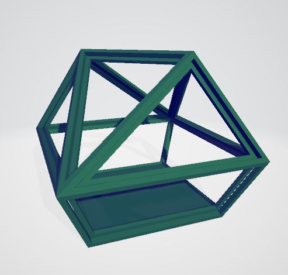

# polyharmonodron

a toy for my neice's 2nd birthday!

its an 11 sided polyhedron

its has 9 buttons and 2 speakers

## Update 12.29.2024
now includes a special mode where if you input the correct sequence, it plays a special sound and rainbow lighting sequence!

# credits

Special thank you to Jason Coombs for modeling the 11 sided object and making the .blend file. 

Special thank you to Peter Chu for taking the model into Fusion and making this wireframe so I could 3d print it and put the laser cut acrylic in it. 

# pinout

## buttons

 button0 = pin 0  
 button1 = pin 1  
 button2 = pin 2 
 button3 = pin 3 
 button4 = pin 4 
 button5 = pin 5 
 button7 = pin 10 
 button8 = pin 11 

## ws2812 (led strip) output
LED_PIN - 9 

 ## audio shield (automatic but good to remember)
 MCLK - 23 
 BCLK - 21 
 LRCLK - 20 
DIN (audio output) - 7